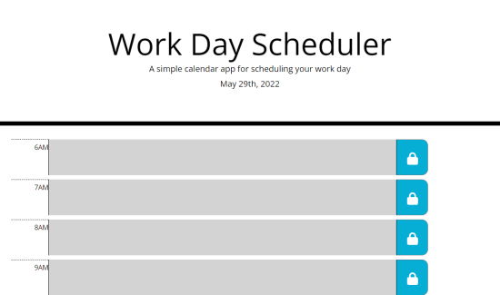

# Work-Day-Scheduler

## Description

A simple calendar application that allows a user to save events for each hour of the day.

## Usage

Enter data into a of the text area and then click the lock button to save your information for that time slot.

## Credits

Google fonts - https://fonts.google.com 
Font Awesome - https://fontawesome.com/ 
Moment.js - https://momentjs.com/ 
jQuery - https://jquery.com/ 
Bootstrap - https://getbootstrap.com

I take credit for creating this website.

## License

